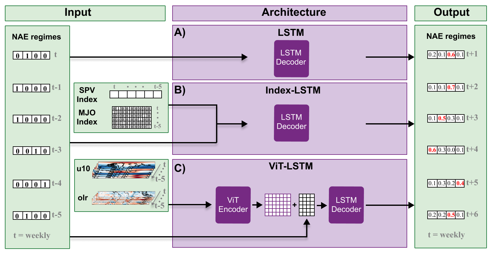

# DL4S2S: Deep Learning for Seasonal-to-Seasonal Forecasting


 
 

#### Please note that while the code basis is complete, full reproducability updates will be made as soon as the peer review is finished.
#### The dataset link will be updated in the coming weeks.

## Table of Contents
1. [Overview](#overview)
2. [Repository Contents](#directory)
3. [Data Instructions](#data)
   
   3.1.[Data](#download)
   
   3.2.[Data Preprocessing](#preprocesing)
   
4. [Training Instructions](#Experiments)
   
    4.1 [Hyperparameter Tuning](#training)
   
    4.2 [Ensemble Training](#Baseline)
   
5. [Result Instruction](#results)

	5.1 [Forecast Skill](#Network)

	5.2 [Windows of Forecasting Opportunity](#woo)

	5.3 [Plots](#Plots)

6. [Further Information](#Refs)

## Overview


This repository contains the code and supplementary packages for the paper **["Deep Learning Meets Teleconnections: Improving S2S Predictions for European Winter Weather"](https://arxiv.org/abs/2504.07625)**  by Bommer et. al. 2025


**Motivation**

Predictions on subseasonal-to-seasonal (S2S) timescales—ranging from two weeks to two months—are crucial for early warning systems but remain challenging owing to chaos in the climate system. Teleconnections, such as the stratospheric polar vortex (SPV) and Madden-Julian Oscillation (MJO), offer windows of enhanced predictability, however, their complex interactions remain underutilized in operational forecasting.

This repository cotains code to train and evaluated deep learning architectures to predict North Atlantic-European (NAE) weather regimes, systematically assessing the role of remote drivers in improving S2S forecast skill of deep learning models. We implemented (A) a Long Short-term Memory (LSTM) network predicting the NAE regimes of the next six weeks based on previous regimes, (B) an Index-LSTM incorporating SPV and MJO indices, and (C) a ViT-LSTM using a Vision Transformer to directly encode stratospheric wind and tropical outgoing longwave radiation fields. These models can be compared with operational hindcasts as well as other AI models. Alongside performance analysis, we provide the code to analyze high-confidence predictions of preceeding NAE regimes, SPV variability and MJO phase patterns, to gain insights in the network's learned behavior and identify potential new drivers




**Citation**

Please cite:
```bibtex
@misc{bommer2025deeplearningmeetsteleconnections,
      title={Deep Learning Meets Teleconnections: Improving S2S Predictions for European Winter Weather}, 
      author={Philine L. Bommer and Marlene Kretschmer and Fiona R. Spuler and Kirill Bykov and Marina M. -C. Höhne},
      year={2025},
      eprint={2504.07625},
      archivePrefix={arXiv},
      primaryClass={cs.LG},
      url={https://arxiv.org/abs/2504.07625}, 
}
```

## Directory Structure


The DL4S2S directory is organized into the following directories:

* `deepS2S`: Package that contains the core deep learning models, datasets, and utilities.
	+ `model`: Defines the deep learning architectures, including LSTM, Index-LSTM, ViT-LSTM (and Aurora-T).
	+ `dataset`: Provides datasets for seasonal-to-seasonal forecasting, including data loading and sample preparation.
	+ `utils`: Offers various utility functions for network construction, visualization, and evaluation.
	+ `preprocessing`: Includes preprocessing functions for the processing of the raw climate data (see Data)
* `Experiments`: Holds experiment-specific code, including scripts and configuration files.
	+ `Preprocessing`: Contains scripts for the downloading and preparation of the climate data.
	+ `Training`: Contains training scripts for different models and datasets.
	+ `Evaluation`: Contains evaluation protocols for Section 4
	+ `Appendix`: Provides additional scripts and utilities for the data analysis and visualization done in the Appendix.

### Installation

You can download a local copy (and then, access the folder):

```bash
git clone https://github.com/philine-bommer/DL4S2S.git
cd DL4S2S
```
Create conda virtual env from sepc file. (Note that, packages like xesmf and eofs require pip installation manually)
```bash
conda create --name myenv --file spec-file.txt
```


[comment]: <> (Make sure to install the requirements in the conda virtual env.)

[comment]: <> (```setup)

[comment]: <> (while read requirement; do conda install --yes $requirement; done < requirements.txt)

[comment]: <> (while read requirement; do conda install -c conda-forge --yes $requirement; done < requirements.txt)

[comment]: <> (```)

#### Package requirements

The package requirements are as follows:
```bash
python>=3.10.0
pytorch-lightning>=1.0.9
```

As well as included package *deepS2S*, which holds all functions:
```bash
cd DeepS2S
pip install -e .
```

## Data Instructions
This project uses ERA5 and 20CRv3 reanalysis data. If you use the provided dataset or the follow our data download and preprocessing steps, please make sure to cite the appropriate works.

For the ERA5 data please make sure to cite the following article by [Hersbach et. al. 2020](https://onlinelibrary.wiley.com/doi/pdf/10.1002/qj.3803) and acknowledge the usage. 

For the 20CRv3 data please make sure to cite the following article by [Slivinski et. al. 2019](https://rmets.onlinelibrary.wiley.com/action/showCitFormats?doi=10.1002%2Fqj.3598) and acknowledge the usage. 


To ensure proper reproducability we provide a [project-based dataset]() which contains the preprocessed data required for hyperparameter tuning, training the model ensembles of LSTM, Index-LSTM and ViT-LSTM alongside the trained model instances for all three architectures and all ensemble members.
Nonetheless, we also relay the code of the full data preprocessing procedure and download routines of both ERA5 an 20CRv3.

### Dataset Download

Please download the `\Data` -folder as a zip-file [here](), unpack the folder and copy to the directory folder:

```bash
cd path/DL4S2S
cp -r Downloads/Data path/DL4S2S/
```
with path to the cloned github directory. If these steps were executed sucessfully, all steps in `Preprocessing/`, as well as all `Training/` protocols can be skipped.
However, if scripts need to be changed (if you want tp include model adaptation or dataset adaptation) individual step beyond the `preprocessing_DATASET_variables.py` which require the raw data (see below). 

### Preprocessing Instruction

Please note that the preprocessing of ERA5 and 20CRv3 has to be run individually, both follow procedures run according to the following steps:

#### Download data

Run `Preprocessing/ERA5/downloadERA5.py` or `Preprocessing/20CRv3/download.py` respectively with command line argument `vrbl` defined 
as either `olr` (olr), `wind` (u10) and `pressure` (z500)

```bash
python Preprocessing/ERA5/downloadERA5.py --vrbl "pressure"
```
Run across all three variables!

#### Preprocessing climate variable fields

Run `Preprocessing/ERA5/preprocessing_ERA5_variables.py` or `Preprocessing/20CRv3/preprocessing_20CRv3_variables.py` respectively with 
command line argument `vrbl` defined as either `olr` (olr), `wind` (u10) and `pressure` (z500)

```bash
python Preprocessing/ERA5/preprocessing_ERA5_variables.py --vrbl "pressure"
```
Run across all three variables!

#### NAE regime calculation

Execute both `Preprocessing/ERA5/generate_NAE_regimes_ERA5.ipynb` or `Preprocessing/20CRv3/generate_NAE_regimes_20CRv3.ipynb`, both python-notebooks
should be executable without adjustments but double check the regime assignment (paragraph: Regime Assignment) and adjust regime names if necessary:

```python
reg ={  0: 'Scandinavian blocking',
        1: 'NAO -',
        2: 'Atlantic Ridge',  
        3: 'NAO+',
        }
```

#### Climate variable indices

Lastly, the climate variable indices need to be calculated including: the SPV index (`Preprocessing/generate_SPV_index.ipynb`) and the MJO indices (`Preprocessing/generate_MJO_index.ipynb`).
For the *SPV index* the according python notebook should be executable without further adjustments. However, for the *MJO index* (phase index for training and rmm1/rmm2 for evaluation) follow the steps listed below:

+ download `rMII_index_latest.txt` to `\Data\Index\` from NOAA
+ run python notebook for each index (phase index, rmm1, rmm2) by commenting/uncommenting the corresponding lines
```python
# var_index = 'phase_number'
var_index = 'rmm1' 
# var_index = 'rmm2'
```

##### Aurora statics
Please note that to reproduce/re-run Aurora results please also generate the static variables needed for the aurora input.
```bash
python  Preprocessing\generate_aurora_statics.py
```

## Training Instructions

If the dataset was downloaded, all training can be skipped and however if you want to make adaptations or run everything from scratch, follow the instruction below.
Please make sure to unpack the `Data_S2S\Network.zip` before running the code. For easy access this zip includes a set of optimal hyperparameters.

### Hyperparameter Tuning

To establish a new optimal set of hyperparameters run the sweep as follows:
```bash
python Training/hyperparameter_tuning_objective.py
```
Please note that the gpu devices used can be specified in `config\config_hps.yaml`:
```yaml
loop_dev: []
```
with `[]` providing the list of gpu device numbers you want to use.

### Ensemble Training
All results in Section 4 are reported based on an ensemble of 100 training runs of each architecture (for mean and standard deviation of both the CSI and Accuracy, as well as
high probability prediction)
Please note that for each network ensemble training the gpu devices used can be specified in `config\config_NETWORK.yaml`:
```yaml
devices: []
```
with `[]` providing the list of gpu device numbers you want to use. e.g. `[2,3]` for devices 2 and 3. The options for `NETWORK` are explained below.
**Main architectures**
To train an enbsemble of the `lstm`, `index_lstm` and `vit_lstm` (`NETWORK`) you can run the following scripts respectively:
```bash
python Training/statistics_NETWORK.py
```

Also note that hyperparameters are automatically set based on the hyperprameters stored in `Data_S2S\Network.zip`. To access hyperparameters tuned in your own reproduction of the experiments 
the according config needs to be edited, e.g. `config\config_NETWORK.yaml`, to:
```yaml
download_path: ''
```
**Aurora-T**
To train Aurora, we first generate the Aurora embeddings for the image data in a seperate step, therefore run the python scripts:
```bash
python Training/generate_aurora_embeddings.py
```
Once the embeddings are generated, the emsemble of Aurora-T models can be trained by running the statistics scripts:
```bash
python Training/statistics_auroraT.py
```
**Logistic Regression**
To generate the Logistic Rgeression ensemble the script can be run without further adjustments
```bash
python Training/logistic_regression.py
```
Please note that if all experiments were performed from scratch, the batch size can be adjusted for the logistic regression in the `config\config_vit_lstm.yaml`.

## Result Instruction

If any training steps were reperformed, prior to any evaluation skript described below, we need to collect the ensemble results.
To this end run `Evaluation\collect_statstics.py` across all three architecture ensembles (`TYPE = lstm, index_lstm, vit_lstm`) by adjusting the configuration of the experiment (`config_TYPE.yaml`)

```bash
python Evaluation\collect_statstics.py --config "_TYPE"
```

### Forecast Skill
**Please note** that for now we do not include a script to caculate the Hindcast regimes, as the data is subject to a subscription for access to the MARS server. However, in the folder `\Data_S2S` we provide both the `acc.csv` and `csi_result.csv`

Execute `Evaluation\performance_experiment_classwise.ipynb` to reproduce the results dicussed in Section 4.1 Forecast skill. The results in Table 1 will be shown in two tables for mean and stnadard deviation respectively.

### Windows of Forecasting Opportunity

To reproduce the evaluation in Section 4.2. of the 90th percentile probability predictions run `Evaluation\prediction_experiment_nae.py` (NAE precursors), `Evaluation\prediction_experiment_spv.py` (SPV index patterns) and `Evaluation\prediction_experiment_mjo.py` (MJO phase precursors). No changes are required.

### Plots

To reproduce the corresponding plots of Section 4.2. (Figures 4-6), please execute the python notebook `Evaluation\result_figure.ipynb`. The notebook also includes the two appendix plots of the number of high probability predictions per timestep and regime, as well as the number of high probability prediction corresponding to active vs inactive MJO phases.


## Further Information


**Contributing**

Contributions to the DL4S2S package are welcome. If you'd like to contribute, please fork the repository, make your changes, and submit a pull request.

**License**

The DL4S2S package is licensed under the MIT License.

**Acknowledgments**

The DL4S2S package was developed by Philine L. Bommer, contains contributions by Kirill Bykov and Fiona Spuler and is based on the work of Paul Boehnke.